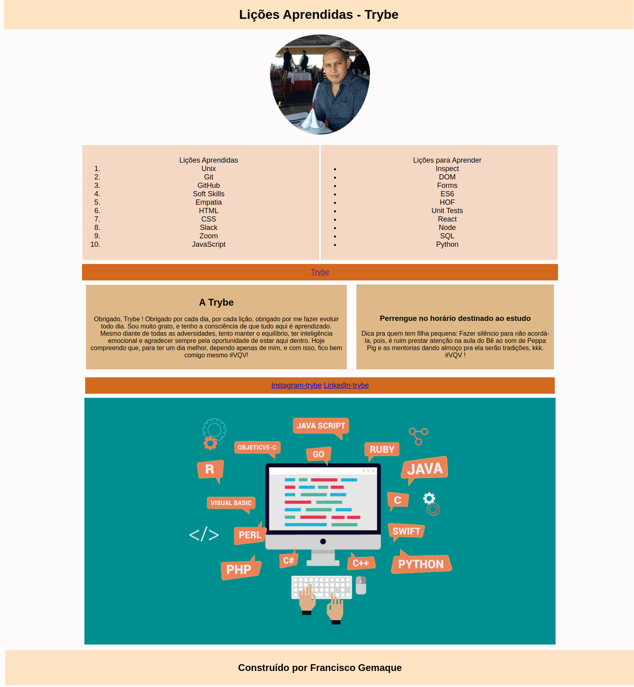

# Lessons Learned

Primeiro projeto desenvolvido no módulo de Fundamentos do Curso de Desenvolvimento Web da Trybe.

O projeto consistia em desenvolver uma página web simples usando HTML e CSS e que contivesse uma série de informações sobre o que nós aprendemos no curso. O site deveria estar com elementos posicionados e estilizados e além disto, deveria conter semântica apropriada para que seja acessível e melhor ranqueado.

## 🚀 Tecnologia

- ⚡ HTML é a linguagem base para se desenvolver qualquer site. 

- ⚡ CSS é uma linguagem de folha de estilo composta por “camadas”, criado com o propósito de estilizar as páginas HTML.

## ✋🏻 Pré-requisitos

- [git](https://git-scm.com/downloads): Ferramenta para gerenciar o código-fonte

- [Visual Studio Code](https://code.visualstudio.com/): Editor de Código Fonte

## :hammer_and_wrench: Antes de iniciar o projeto.

No diretório do projeto, instale as dependências e inicialize o projeto:

### `npm install`

Instala as dependências.
